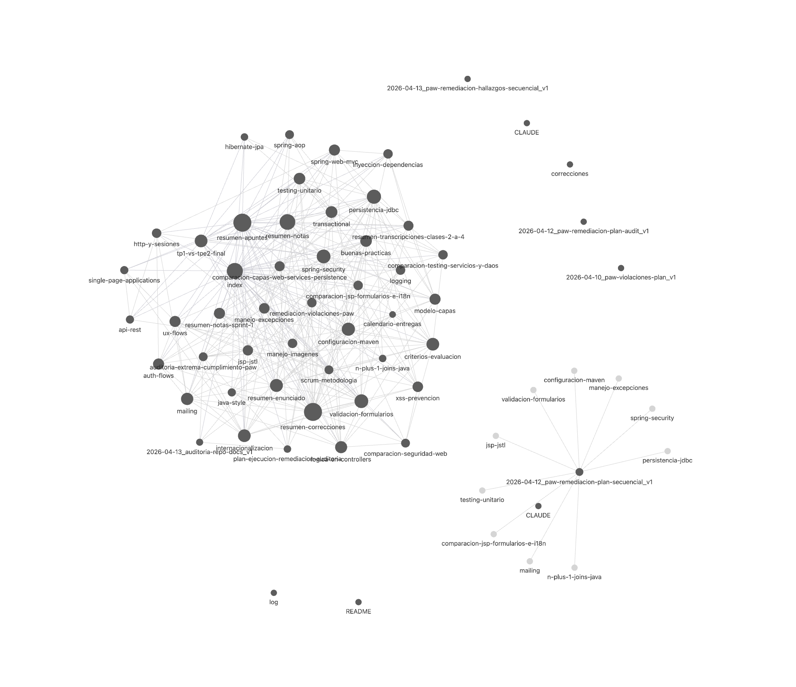

# 🧠 PAW Wiki - Arquitectura de Conocimiento Persistente

Bienvenido al **PAW Wiki**, un "Segundo Cerebro" estructurado diseñado para almacenar, sintetizar y hacer evolucionar el conocimiento del proyecto **PAW (Programación de Aplicaciones Web)**.

Este repositorio sirve como un centro centralizado para conceptos técnicos, patrones arquitectónicos y documentación oficial, optimizado tanto para la lectura humana como para la ingesta por parte de LLMs.

---

## 🏗️ Arquitectura del Repositorio

El proyecto sigue un esquema de conocimiento compuesto definido en [CLAUDE.md](docs/CLAUDE.md).

```bash
docs/
├── raw/            # 📥 Fuentes inmutables (PDFs, manuales oficiales, assets)
├── wiki/           # 📝 Páginas de conocimiento sintetizado (Concepto, Entidad, Fuente)
├── index.md        # 📖 Índice Maestro (Vista categorizada de todas las páginas)
├── log.md          # 📜 Registro de Actividad (Récord cronológico de actualizaciones)
└── CLAUDE.md       # ⚙️ Esquema y convenciones de flujo de trabajo
```

### Componentes Clave
- **`raw/`**: La fuente de verdad. Documentos originales de la cátedra o manuales técnicos.
- **`wiki/`**: El cerebro. Archivos Markdown que utilizan metadatos frontmatter y enlaces de estilo Obsidian `[[como-este]]`.
- **`index.md`**: El faro. Siempre actualizado para reflejar el estado actual del wiki.

---

## 🛠️ Stack Tecnológico (PAW TPE1)

Este wiki se especializa en el desarrollo del proyecto PAW utilizando el siguiente stack:

- **Core**: Java 21, Spring Web MVC (Puro, sin Spring Boot).
- **Frontend**: JSP (JavaServer Pages), JSTL.
- **Base de Datos**: PostgreSQL (Producción), HSQLDB (Testing), JDBC para conectividad.
- **Herramienta de Construcción**: Maven.
- **Patrones**: Domain Driven Design (DDD), Inyección de Dependencias, Thin Controllers.

---

## 🤖 Flujo de Trabajo para LLMs

Este repositorio está diseñado para ser "Nativo para IA". Si eres un asistente de IA trabajando en este repo:

1. **Ingerir**: Lee las fuentes en `docs/raw/` y sintetízalas en `docs/wiki/`.
2. **Enlazar**: Usa `[[enlaces-internos]]` para conectar conceptos y mantener la bidireccionalidad.
3. **Registrar**: Cada ingesta o cambio significativo debe quedar registrado en `docs/log.md` y referenciado en `docs/index.md`.
4. **Seguir el Esquema**: Adhiérete estrictamente a las reglas definidas en [CLAUDE.md](docs/CLAUDE.md).

---

## 🚀 Cómo Usar

### Para Humanos
- Comienza explorando el [Índice Maestro](docs/index.md).
- Busca conceptos específicos (ej: `spring-security`, `jdbc-patterns`) en la carpeta `docs/wiki/`.
- Sigue los enlaces internos para navegar entre temas relacionados.
- Esta pensado para usar desde Obsidian.


### Para Colaboradores
1. Agrega nuevas fuentes a `docs/raw/`.
2. Ejecuta un flujo de ingesta con un asistente de IA para procesar la nueva información.
3. Verifica que el `index.md` y el `log.md` se actualicen correctamente.

---

*Mantenedor: keodubo*