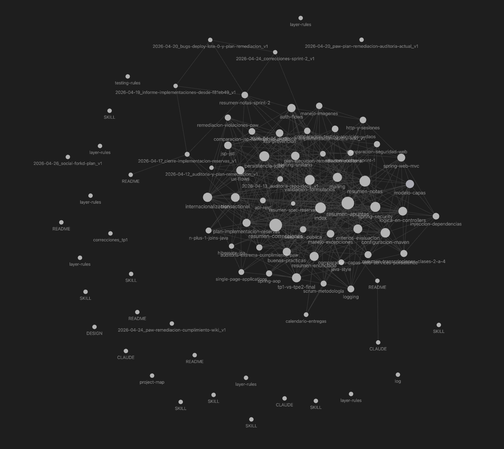

# PAW Wiki - Arquitectura de Conocimiento Persistente

Bienvenido al **PAW Wiki**, un "Segundo Cerebro" estructurado diseñado para almacenar, sintetizar y hacer evolucionar el conocimiento del proyecto **PAW (Programación de Aplicaciones Web)**.

Este repositorio sirve como un centro centralizado para conceptos técnicos, patrones arquitectónicos y documentación oficial, optimizado tanto para la lectura humana como para la ingesta por parte de LLMs.

---

## Quickstart

Este repo no necesita servidor, base de datos ni build. Funciona como una wiki Markdown que podes leer en GitHub, abrir en Obsidian o usar como contexto para un agente.

### 1. Clonar

```bash
git clone https://github.com/keodubo/PAW-Wiki.git
cd PAW-Wiki
```

### 2. Abrir la wiki

Opcion simple:

```bash
open README.md
```

Opcion recomendada:

1. Instalar Obsidian.
2. Elegir `Open folder as vault`.
3. Seleccionar la carpeta `PAW-Wiki`.
4. Abrir `docs/index.md`.
5. Usar la vista de grafo para navegar los links `[[...]]`.

### 3. Usar la wiki

1. Leer [docs/index.md](docs/index.md).
2. Abrir una pagina de `docs/wiki/`.
3. Seguir los links internos.
4. Si vas a agregar material, usar [docs/examples/ingesta-publica.md](docs/examples/ingesta-publica.md).

### 4. Configurar material privado

```bash
mkdir -p docs/private/mi-webapp/raw
mkdir -p docs/private/mi-webapp/wiki
mkdir -p docs/private/mi-webapp/plans
touch docs/private/mi-webapp/README.md
touch docs/private/mi-webapp/wiki/nexo-wiki-publica.md
```

`docs/private/` esta ignorado por Git. Todo lo personal, especifico de tu webapp o sensible debe ir ahi.

### 5. Instalar skills opcionales

Las skills son opcionales. Solo sirven si queres que Codex, Claude u otro agente use reglas especializadas de PAW.

```bash
mkdir -p "${CODEX_HOME:-$HOME/.codex}/skills"
cp -R skills/paw-* "${CODEX_HOME:-$HOME/.codex}/skills/"
```

Despues abri una conversacion nueva del agente para que detecte las skills.

### 6. Verificar antes de commitear

```bash
git status --short --ignored=matching
git ls-files docs/private
```

`git ls-files docs/private` no deberia imprimir nada.

Mas detalle:

- [Setup local](docs/examples/setup-local.md)
- [Instalacion de skills](docs/examples/instalar-skills.md)
- [Checklist de publicacion](docs/examples/checklist-publicacion.md)
- [Troubleshooting](docs/examples/troubleshooting.md)

## Arquitectura del Repositorio

El proyecto sigue un esquema de conocimiento compuesto definido en [CLAUDE.md](docs/CLAUDE.md).

```bash
README.md
obsidian-graph-view.png
docs/
├── examples/       # Ejemplos copy-paste para usar y mantener la wiki
├── raw/            # Fuentes inmutables o historicas
├── wiki/           # Paginas sintetizadas con frontmatter y links Obsidian
├── superpowers/    # Planes largos generados por Superpowers
├── index.md        # Indice maestro del wiki
├── log.md          # Registro cronologico de cambios
├── tree.txt        # Snapshot del arbol de docs/
└── CLAUDE.md       # Reglas de trabajo para agentes
skills/
└── paw-*           # Skills instalables basadas en PAW-Wiki
```

`docs/private/` es una carpeta local ignorada por Git. Usala para fuentes, planes o notas personales que no deban publicarse.

### Componentes Clave
- **`raw/`**: La fuente de verdad. Documentos originales de la cátedra o manuales técnicos.
- **`wiki/`**: El cerebro. Archivos Markdown que utilizan metadatos frontmatter y enlaces de estilo Obsidian `[[como-este]]`.
- **`index.md`**: El faro. Siempre actualizado para reflejar el estado actual del wiki.
- **`examples/`**: Ejemplos de prompts, flujos y checklists para usar la wiki sin adivinar el procedimiento.
- **`skills/`**: Skills reutilizables para que Codex implemente features siguiendo la wiki, el stack PAW y la separación por capas.

---

## Stack Tecnológico (PAW TPE1)

Este wiki se especializa en el desarrollo del proyecto PAW utilizando el siguiente stack:

- **Core**: Java 21, Spring Web MVC (Puro, sin Spring Boot).
- **Frontend**: JSP (JavaServer Pages), JSTL.
- **Base de Datos**: PostgreSQL (Producción), HSQLDB (Testing), JDBC para conectividad.
- **Herramienta de Construcción**: Maven.
- **Patrones**: Domain Driven Design (DDD), Inyección de Dependencias, Thin Controllers.

---

## Flujo de Trabajo para LLMs

Este repositorio está diseñado para ser "Nativo para IA". Si eres un asistente de IA trabajando en este repo:

1. **Ingerir**: Lee las fuentes en `docs/raw/` y sintetízalas en `docs/wiki/`.
2. **Enlazar**: Usa `[[enlaces-internos]]` para conectar conceptos y mantener la bidireccionalidad.
3. **Registrar**: Cada ingesta o cambio significativo debe quedar registrado en `docs/log.md` y referenciado en `docs/index.md`.
4. **Seguir el Esquema**: Adhiérete estrictamente a las reglas definidas en [CLAUDE.md](docs/CLAUDE.md).

---

## Cómo Usar

### Para Humanos
- Comenza explorando el [Indice Maestro](docs/index.md).
- Busca conceptos especificos (ej: `spring-security`, `persistencia-jdbc`) en la carpeta `docs/wiki/`.
- Sigue los enlaces internos para navegar entre temas relacionados.
- Esta pensado para usar desde Obsidian.
- Usa [docs/examples/README.md](docs/examples/README.md) cuando necesites prompts o flujos de ejemplo.



### Para Colaboradores
1. Agrega nuevas fuentes a `docs/raw/`.
2. Ejecuta un flujo de ingesta con un asistente de IA para procesar la nueva información.
3. Verifica que el `index.md` y el `log.md` se actualicen correctamente.
4. Si la fuente es personal o especifica de tu proyecto, guardala en `docs/private/` y no la subas.

Ejemplos listos para usar:

- [Setup local](docs/examples/setup-local.md)
- [Ingesta publica](docs/examples/ingesta-publica.md)
- [Consulta a la wiki](docs/examples/consulta-wiki.md)
- [Uso con agentes](docs/examples/uso-con-agente.md)
- [Second brain privado](docs/examples/second-brain-privado.md)
- [Checklist de publicacion](docs/examples/checklist-publicacion.md)
- [Troubleshooting](docs/examples/troubleshooting.md)

### Para Instalar las Skills en Codex, Claude u otros asistentes

Desde la raíz de este repositorio:

```bash
mkdir -p "${CODEX_HOME:-$HOME/.codex}/skills"
cp -R skills/paw-* "${CODEX_HOME:-$HOME/.codex}/skills/"
```

Para Claude Code:

```bash
mkdir -p "$HOME/.claude/skills"
cp -R skills/paw-* "$HOME/.claude/skills/"
```

Después abrí una conversación nueva y usa:

```text
Usa $paw-feature-master para planificar esta feature de mi app PAW según la wiki y las capas.
```

Más detalles para otros asistentes compatibles en [skills/README.md](skills/README.md).

---

*Mantenedor: keodubo*
