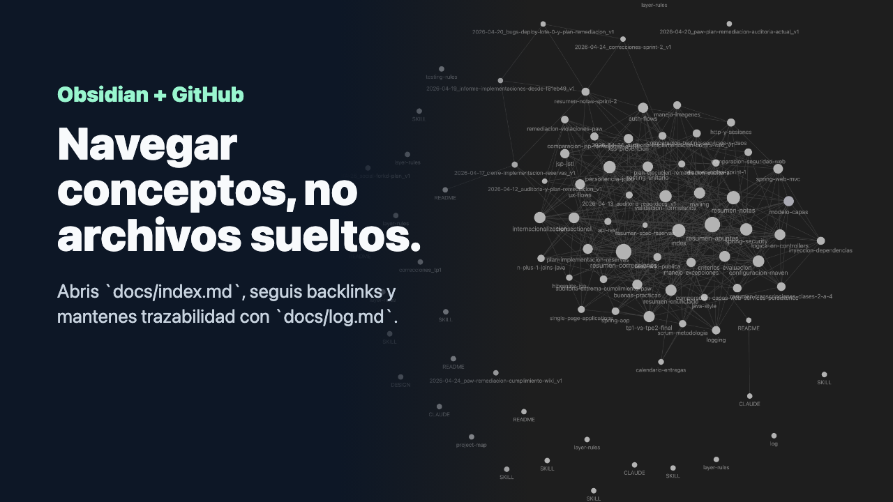
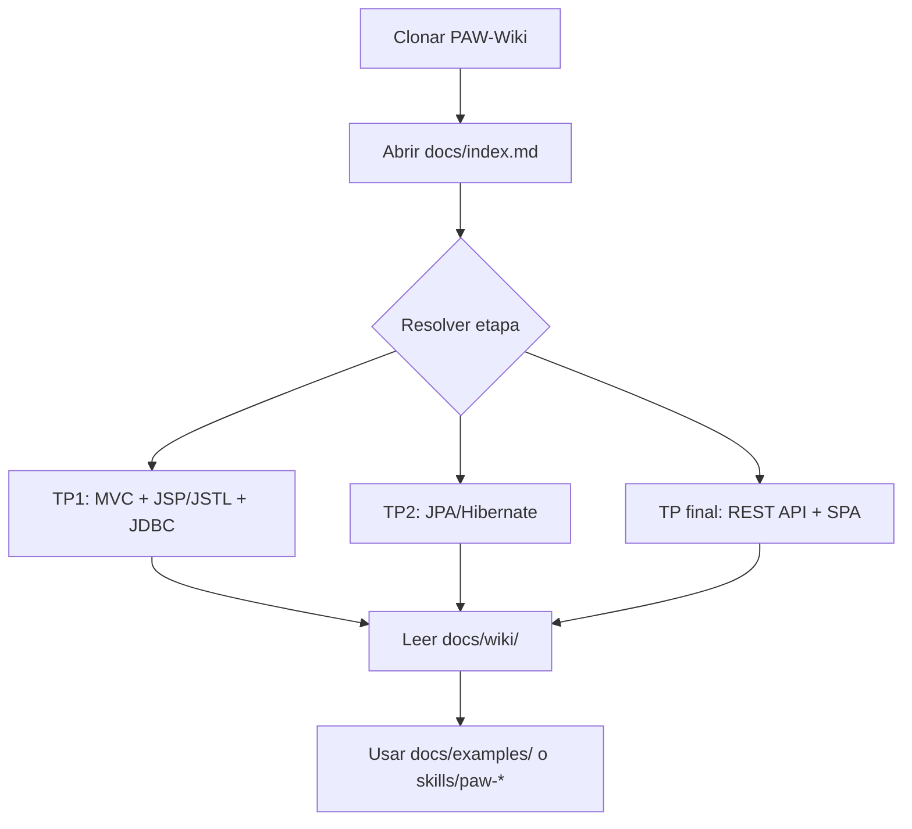
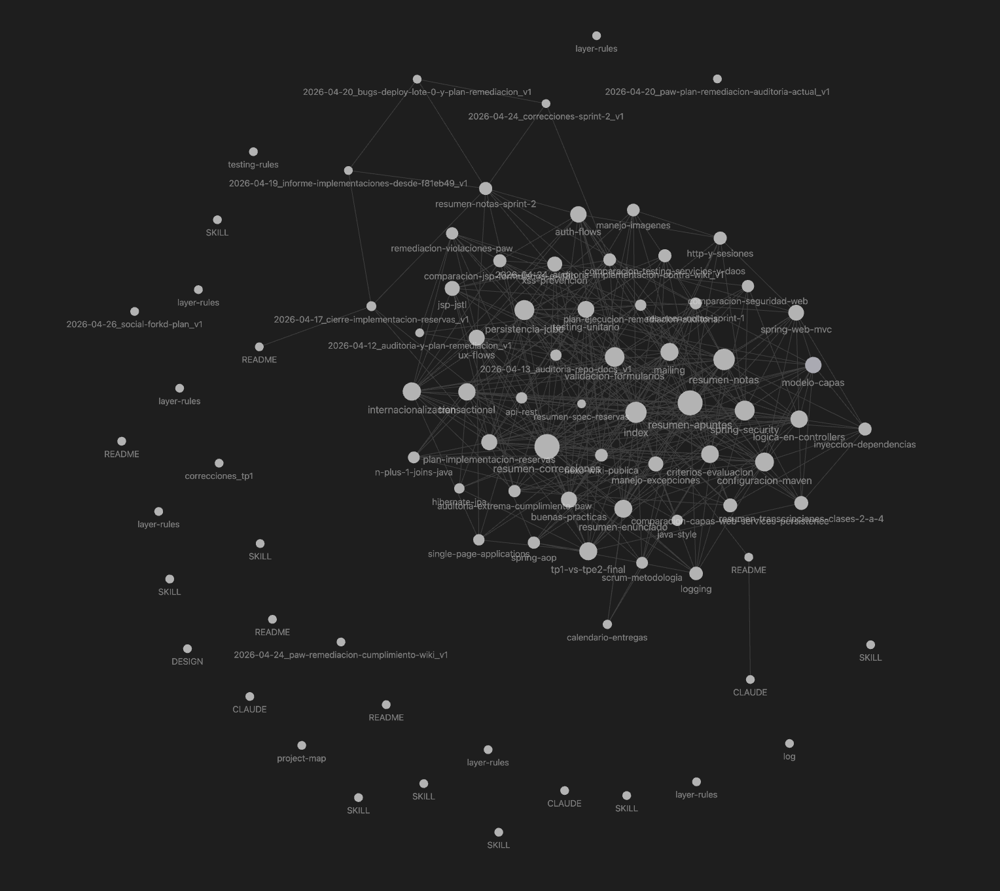
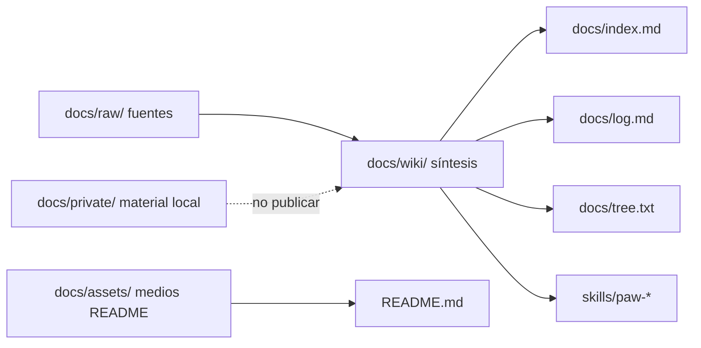

# PAW Wiki - Base de Conocimiento para PAW

**PAW Wiki** es una base de conocimiento en Markdown para organizar material de
**PAW (Programación de Aplicaciones Web)** por etapa: `TP1`, `TP2` y
`TP final`.

Centraliza conceptos técnicos, patrones arquitectónicos, criterios de cursada,
ejemplos operativos y skills reutilizables para agentes. Está pensada para
lectura humana, navegación en Obsidian y uso como contexto de trabajo para
asistentes de IA.

Si te sirve, deja una estrella en GitHub.

[](docs/assets/paw-wiki-demo.mp4)

[Ver demo en MP4](docs/assets/paw-wiki-demo.mp4)

---

## Quickstart

Este repositorio no necesita servidor, base de datos ni build. Funciona como una
wiki Markdown que puedes leer en GitHub, abrir en Obsidian o usar como contexto
para un agente.


```mermaid
flowchart TD
    A["Clonar PAW-Wiki"] --> B["Abrir docs/index.md"]
    B --> C{"Resolver etapa"}
    C --> D["TP1: MVC + JSP/JSTL + JDBC"]
    C --> E["TP2: JPA/Hibernate"]
    C --> F["TP final: REST API + SPA"]
    D --> G["Leer docs/wiki/"]
    E --> G
    F --> G
    G --> H["Usar docs/examples/ o skills/paw-*"]
```

### 1. Clonar

Uso recomendado dentro de una app PAW:

```bash
cd /ruta/a/tu-repo-paw
printf "\n# Local PAW wiki, not part of the delivered app\n/PAW-Wiki/\n" >> .gitignore
git clone https://github.com/keodubo/PAW-Wiki.git PAW-Wiki
cd PAW-Wiki
```

Así la wiki queda junto al código, pero el repositorio principal de la app no
incluye documentos auxiliares ni el historial de este repositorio.

<details>
<summary>Verificar que la app no trackea PAW-Wiki</summary>

Desde la raíz de la app PAW:

```bash
git status --short --ignored=matching
git ls-files PAW-Wiki
```

`PAW-Wiki/` debería aparecer como ignorado o no aparecer. `git ls-files
PAW-Wiki` no debería imprimir nada.

</details>

<details>
<summary>Usarlo fuera de una app PAW</summary>

```bash
git clone https://github.com/keodubo/PAW-Wiki.git
cd PAW-Wiki
```

</details>

### 2. Abrir la wiki

Opción simple:

```bash
open README.md
```

Opción recomendada:

1. Instalar Obsidian.
2. Elegir `Open folder as vault`.
3. Seleccionar la carpeta `PAW-Wiki`.
4. Abrir `docs/index.md`.
5. Usar la vista de grafo para navegar enlaces `[[...]]`.



### 3. Usar la wiki

1. Leer [docs/index.md](docs/index.md).
2. Resolver la etapa de trabajo: `TP1`, `TP2` o `TP final`.
3. Abrir [docs/wiki/resumen-clases-paw-2026.md](docs/wiki/resumen-clases-paw-2026.md)
   y [docs/wiki/tp1-vs-tpe2-final.md](docs/wiki/tp1-vs-tpe2-final.md) si la
   tarea depende de stack, migración o cátedra.
4. Abrir una página de `docs/wiki/`.
5. Seguir los enlaces internos.
6. Si vas a agregar material, usar
   [docs/examples/ingesta-publica.md](docs/examples/ingesta-publica.md).

<details>
<summary>Prompt recomendado para agentes de coding</summary>

```text
Antes de usar PAW-Wiki, ejecuta el flujo de docs/examples/actualizar-wiki.md.
Si PAW-Wiki está limpia y hay cambios en origin/main, puedes hacer git pull --ff-only.
Si hay cambios locales, no modifiques nada: muestra git status y git diff.

Usa $paw-feature-master para trabajar esta tarea de mi app PAW.
Primero lee el checkout, CLAUDE.md, PAW-Wiki/docs/CLAUDE.md y PAW-Wiki/docs/index.md.
Estoy en etapa TP1/TP2/TP final.
Después decide qué subskills de capa o migración hacen falta y úsalas solo si corresponden.
```

</details>

### 4. Configurar material privado

`docs/private/` está ignorado por Git. Todo material personal, específico de tu
webapp o sensible debe ir allí.

<details>
<summary>Crear estructura privada local</summary>

```bash
mkdir -p docs/private/mi-webapp/raw
mkdir -p docs/private/mi-webapp/wiki
mkdir -p docs/private/mi-webapp/plans
touch docs/private/mi-webapp/README.md
touch docs/private/mi-webapp/wiki/nexo-wiki-publica.md
```

</details>

### 5. Instalar skills opcionales

Las skills son opcionales. Sirven para que Codex, Claude u otro agente use
reglas especializadas de PAW.

<details>
<summary>Instalar en Codex</summary>

```bash
mkdir -p "${CODEX_HOME:-$HOME/.codex}/skills"
cp -R skills/paw-* "${CODEX_HOME:-$HOME/.codex}/skills/"
```

</details>

<details>
<summary>Instalar en Claude Code</summary>

```bash
mkdir -p "$HOME/.claude/skills"
cp -R skills/paw-* "$HOME/.claude/skills/"
```

</details>

Después abre una conversación nueva del agente para que detecte las skills. Para
trabajo real sobre una app PAW, empieza por `$paw-feature-master`; esa skill
decide si corresponde enrutar a `$paw-webapp-layer`, `$paw-services-layer`,
`$paw-persistence-layer`, `$paw-testing-layer`, `$paw-tp2-migration` o
`$paw-tp-final-migration`.

### 6. Verificar antes de publicar cambios

```bash
git status --short --ignored=matching
git ls-files docs/private
```

`git ls-files docs/private` no debería imprimir nada.

Más detalle:

- [Setup local](docs/examples/setup-local.md)
- [Wiki dentro del repo PAW](docs/examples/wiki-dentro-repo-paw.md)
- [Actualizar wiki local](docs/examples/actualizar-wiki.md)
- [Instalación de skills](docs/examples/instalar-skills.md)
- [Uso con agentes y skills](docs/examples/uso-con-agente.md)
- [Checklist de publicación](docs/examples/checklist-publicacion.md)
- [Troubleshooting](docs/examples/troubleshooting.md)

---

## Arquitectura del Repositorio

El repositorio sigue un esquema de conocimiento compuesto definido en
[docs/CLAUDE.md](docs/CLAUDE.md).


```mermaid
flowchart LR
    R["docs/raw/ fuentes"] --> W["docs/wiki/ síntesis"]
    W --> I["docs/index.md"]
    W --> L["docs/log.md"]
    W --> T["docs/tree.txt"]
    W --> S["skills/paw-*"]
    A["docs/assets/ medios README"] --> M["README.md"]
    P["docs/private/ material local"] -. "no publicar" .-> W
```

```bash
README.md
obsidian-graph-view.png
docs/
├── assets/         # Videos e imágenes públicas usadas por el README
├── examples/       # Ejemplos copy-paste para usar y mantener la wiki
├── raw/            # Fuentes inmutables o históricas
├── wiki/           # Páginas sintetizadas con frontmatter y enlaces Obsidian
├── superpowers/    # Planes locales generados por Superpowers, ignorados por Git
├── index.md        # Índice maestro del wiki
├── log.md          # Registro cronológico de cambios
├── tree.txt        # Snapshot del árbol público de docs/
└── CLAUDE.md       # Reglas de trabajo para agentes
skills/
└── paw-*           # Skills instalables basadas en PAW-Wiki
```

### Componentes clave

- **`docs/raw/`**: fuentes inmutables. Incluye documentos originales de la
  cátedra, apuntes y PDFs `PAW*` de clases. Los PDFs viejos pueden contener
  versiones de dependencias históricas: no usarlas como recomendación vigente
  sin contrastar el checkout o enunciado actual.
- **`docs/wiki/`**: páginas Markdown con frontmatter y enlaces estilo Obsidian
  `[[como-este]]`. Las páginas canónicas para etapa son
  `resumen-clases-paw-2026.md` y `tp1-vs-tpe2-final.md`.
- **`docs/assets/`**: medios públicos usados por el README, como el video demo y
  su poster.
- **`docs/private/`**: carpeta local ignorada por Git para fuentes, planes o
  notas personales que no deban publicarse.
- **`docs/superpowers/plans/`**: planes largos locales ignorados por Git. Si un
  plan debe quedar publicable, moverlo a `docs/wiki/` o convertirlo en una
  página pública antes de actualizar `docs/index.md`, `docs/log.md` y
  `docs/tree.txt`.
- **`skills/`**: skills reutilizables para que agentes trabajen con PAW siguiendo
  la etapa, el stack y la separación por capas.

---

## Dominio PAW por Etapa

Este wiki no debe leerse como material solo de TP1. La cátedra evoluciona el
stack por etapa y la respuesta correcta depende de esa etapa.

| Etapa | Canon operativo | Skills esperadas |
| --- | --- | --- |
| TP1 | Spring Web MVC sin Boot, JSP/JSTL, JDBC, PostgreSQL/HSQLDB, Maven, capas clásicas y validación/i18n/security server-side. | `$paw-feature-master` + subskills de capa. No introducir JPA, API REST o SPA por accidente. |
| TP2 | Migración de persistencia desde JDBC hacia JPA/Hibernate manteniendo contratos de servicios y producto estable. | `$paw-feature-master` + `$paw-tp2-migration` + capas afectadas. |
| TP final | REST API + SPA/frontend, DTOs, auth stateless, build frontend, cache y separación clara entre API y cliente. | `$paw-feature-master` + `$paw-tp-final-migration` + capas afectadas. |

Fuentes clave:

- [docs/wiki/resumen-clases-paw-2026.md](docs/wiki/resumen-clases-paw-2026.md)
- [docs/wiki/tp1-vs-tpe2-final.md](docs/wiki/tp1-vs-tpe2-final.md)
- [docs/wiki/hibernate-jpa.md](docs/wiki/hibernate-jpa.md)
- [docs/wiki/api-rest.md](docs/wiki/api-rest.md)
- [docs/wiki/single-page-applications.md](docs/wiki/single-page-applications.md)

---

## Flujo de Trabajo para Asistentes de IA

Si eres un asistente de IA trabajando en este repositorio:

1. **Ingerir**: leer las fuentes en `docs/raw/` y sintetizarlas en `docs/wiki/`.
2. **Enlazar**: usar `[[enlaces-internos]]` para conectar conceptos y mantener
   la bidireccionalidad.
3. **Registrar**: cada ingesta o cambio significativo debe quedar registrado en
   `docs/log.md` y referenciado en `docs/index.md`.
4. **Actualizar contexto**: si hay acceso a Git remoto, revisar `origin/main`
   antes de usar la wiki; hacer `pull --ff-only` solo si el checkout está
   limpio.
5. **Resolver etapa**: antes de recomendar stack, migraciones o tooling,
   distinguir `TP1`, `TP2` y `TP final`.
6. **No congelar dependencias viejas**: si un PDF antiguo menciona versiones
   concretas, tratarlas como contexto histórico y validar contra el checkout
   actual.
7. **Seguir el esquema**: respetar las reglas definidas en
   [docs/CLAUDE.md](docs/CLAUDE.md).

---

## Cómo Usar

### Para humanos

- Comienza explorando el [índice maestro](docs/index.md).
- Busca conceptos específicos, por ejemplo `spring-security` o
  `persistencia-jdbc`, en la carpeta `docs/wiki/`.
- Sigue los enlaces internos para navegar entre temas relacionados.
- Usa Obsidian si quieres vista de grafo y backlinks locales.
- Usa [docs/examples/README.md](docs/examples/README.md) cuando necesites
  prompts o flujos de ejemplo.

### Para colaboradores

1. Agrega nuevas fuentes a `docs/raw/`.
2. Ejecuta un flujo de ingesta con un asistente de IA para procesar la nueva
   información.
3. Verifica que `docs/index.md`, `docs/log.md` y `docs/tree.txt` se actualicen
   correctamente.
4. Si la fuente es personal o específica de tu proyecto, guárdala en
   `docs/private/` y no la publiques.

Ejemplos listos para usar:

- [Setup local](docs/examples/setup-local.md)
- [Wiki dentro del repo PAW](docs/examples/wiki-dentro-repo-paw.md)
- [Actualizar wiki local](docs/examples/actualizar-wiki.md)
- [Ingesta pública](docs/examples/ingesta-publica.md)
- [Consulta a la wiki](docs/examples/consulta-wiki.md)
- [Uso con agentes](docs/examples/uso-con-agente.md)
- [Second brain privado](docs/examples/second-brain-privado.md)
- [Checklist de publicación](docs/examples/checklist-publicacion.md)
- [Troubleshooting](docs/examples/troubleshooting.md)

### Markdown avanzado usado

Este README usa features útiles de GitHub Markdown sin agregar build:

| Feature | Uso en este README |
| --- | --- |
| Video MP4 | Demo visual generada con Remotion y versionada en `docs/assets/paw-wiki-demo.mp4`. |
| Mermaid | Mapas de onboarding y arquitectura. |
| HTML details | Comandos y prompts largos colapsables. |
| LaTeX | Reservado para páginas técnicas cuando ayude, por ejemplo `$O(n + 1)$` en notas sobre N+1. |

---

*Mantenedor: keodubo*
