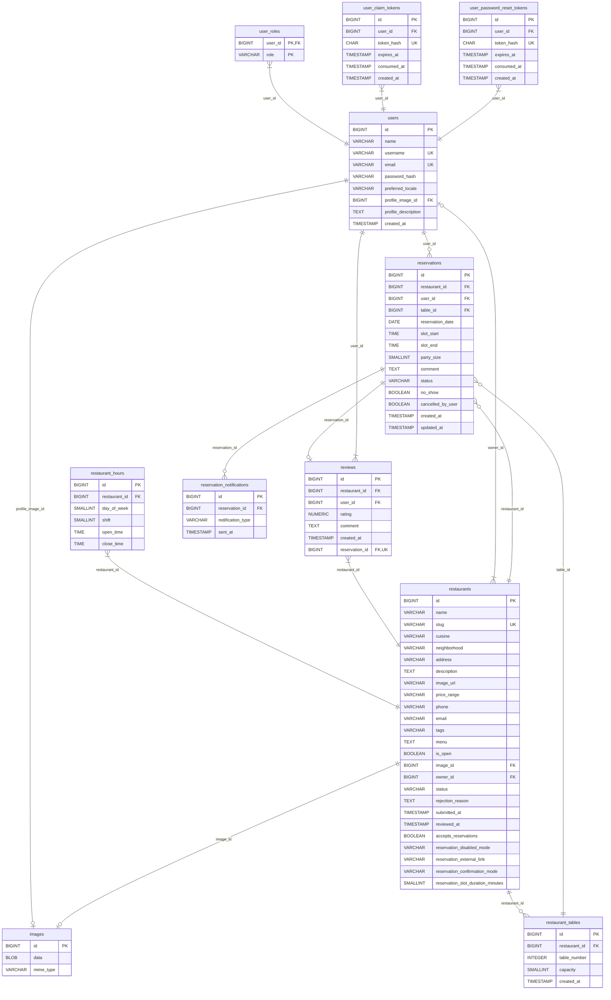

## Notas funcionales para reservas

- PENDING y CONFIRMED bloquean el slot de la mesa.
- CANCELLED y COMPLETED no bloquean disponibilidad.
- `no_show` es un flag, no un estado principal.
- Una reserva se completa automáticamente cuando termina su franja horaria y estaba CONFIRMED.
- Un restaurante no puede cambiar su layout si tiene reservas PENDING o CONFIRMED.
- Los slots se derivan de `restaurant_hours` + `reservation_slot_duration_minutes`.
- La review solo puede existir sobre una reserva completada.

